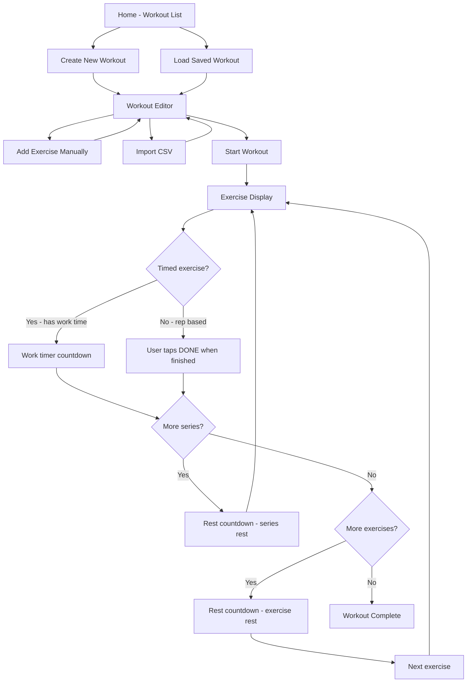

# Training Timer - Architecture Plan

## Overview
A minimal interval training web app built with React, Tailwind CSS, and shadcn/ui. Optimized for tablet use (11" Redmi Pad 2) with touch-friendly controls.

## Tech Stack
- **React 19** + **TypeScript** via Vite
- **Tailwind CSS v4**
- **shadcn/ui** (latest, with new CLI)
- **localStorage** for workout persistence

## Data Model

Values from CSV can be ranges (e.g. `8-12`, `45-60`) or special strings like `tempo`. We store the raw string values and parse min/max for timer use.

```typescript
interface RangeValue {
  min: number;
  max: number;
  raw: string; // original CSV value for display
}

interface Exercise {
  id: string;
  name: string;              // Esercizio
  series: RangeValue;        // Serie - e.g. 2-3
  repetitions: string;       // Ripetizioni - can be number range or tempo
  workTime: RangeValue;      // Tempo Lavoro (s) - e.g. 24-36
  restBetweenSeries: RangeValue;    // Recupero Serie (s)
  restBetweenExercises: RangeValue; // Recupero Esercizio (s)
}

interface Workout {
  id: string;
  name: string;
  exercises: Exercise[];
  createdAt: string;
  updatedAt: string;
}

// During execution, user picks concrete values from ranges
interface ExecutionConfig {
  seriesCount: number;       // picked from series range
  workTimeSec: number;       // picked from work time range
  restSeriesSec: number;     // picked from rest series range
  restExerciseSec: number;   // picked from rest exercise range
}
```

## CSV Format - Real Example
```csv
Esercizio,Serie,Ripetizioni,Tempo Lavoro (s),Recupero Serie (s),Recupero Esercizio (s)
Dish Tuck,2,8-12,24-36,45-60,60
Copenhagen Side Plank DX,2,tempo,10-20,30-45,0
Push-up con Barre,2-3,8-15,20-40,60-90,0
```

Key: values can be ranges like `8-12` or `45-60`, and repetitions can be `tempo` meaning a timed exercise.

## App Flow



## Workout Execution Logic

For range values, the app uses the **max value** by default for timers (user can adjust before starting). During execution:

1. **Show exercise**: Display name, current series number, and repetitions
2. **If work time > 0**: Auto-countdown work timer
3. **If rep-based**: Show rep count, wait for user to tap DONE
4. **If `tempo`**: Show work time countdown as the exercise itself
5. **After exercise done**: Start rest countdown between series
6. **After last series**: Start rest countdown between exercises (if > 0, skip if 0)
7. **After last exercise**: Show completion screen

## Screen Layout

### 1. Home Screen
- App title
- List of saved workouts with name and exercise count
- New Workout button
- Tap a workout to open editor

### 2. Workout Editor
- Workout name input at top
- Exercise list as cards showing all values
- Each card: tap to edit, swipe/button to delete
- Add Exercise button opens form with all fields (supporting range input)
- Import CSV button with file picker
- Save button and Start Workout button at bottom
- All fields support range input: e.g. typing `8-12` is valid

### 3. Workout Execution Screen
- Large exercise name centered
- Series indicator: `Serie 2/4`
- Repetitions or `TEMPO` label displayed large
- For timed exercises: circular countdown timer
- For rep exercises: large DONE button (min 80px tall)
- During rest: large countdown with label `Recupero` and seconds remaining
- Skip rest button available
- Pause/Resume button

## Component Structure

```
src/
  components/
    ui/                  # shadcn components
    WorkoutList.tsx      # Home screen
    WorkoutEditor.tsx    # Edit workout
    ExerciseForm.tsx     # Add/edit single exercise dialog
    ExerciseCard.tsx     # Exercise display in editor
    CsvUpload.tsx        # CSV file upload + parse
    WorkoutPlayer.tsx    # Execution screen controller
    CountdownTimer.tsx   # Circular countdown display
    ExerciseDisplay.tsx  # Current exercise info during workout
  hooks/
    useWorkouts.ts       # localStorage CRUD for workouts
    useTimer.ts          # Countdown timer logic with pause/resume
  lib/
    csv-parser.ts        # Parse CSV with Italian headers and range values
    range.ts             # Parse and handle range values like 8-12
    utils.ts             # shadcn utils
  types/
    index.ts             # TypeScript interfaces
  App.tsx                # State-based navigation
  main.tsx
  index.css              # Tailwind imports
```

## Key Design Decisions

1. **No router library** - Simple state-based navigation for 3 screens
2. **localStorage** - Sufficient for saving workouts, no backend needed
3. **Range values stored as strings** - Preserving original CSV format, parsed on demand
4. **Max value used by default for timers** - User can adjust before starting
5. **Large touch targets** - All interactive elements min 48px, primary buttons 80px+
6. **Audio beep + vibration** on timer completion via Web Audio API + Vibration API
7. **Tablet-first responsive** - Designed for 11 inch, works on other sizes
8. **Italian CSV headers** mapped to English internal model
9. **`tempo` repetitions** treated as timed exercises using work time as duration

## Implementation Order

1. Project setup: Vite + React + Tailwind + shadcn
2. Types and range parsing utilities
3. localStorage hooks for workout CRUD
4. CSV parser handling ranges and `tempo`
5. Workout editor UI with exercise form
6. Workout list/home screen
7. Workout execution screen with timer
8. Audio/vibration feedback
9. Polish touch interactions and responsive layout
